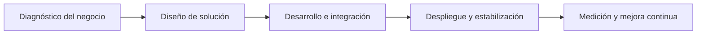

	

	
	
	
	

	
	
	
	
	
	
	

<h1 align="center">Hexoneira</h1>

<strong>Coding the dream, engineering the reality.</strong>

---

## Quiénes somos

Hexoneira nace de una idea simple y poderosa: **seis sueños convertidos en ingeniería real**.

El nombre viene del griego y representa nuestra esencia: un equipo de seis fundadores, estudiantes de Ingeniería de Sistemas en la Distrital y miembros del GLUD, construyendo soluciones con visión técnica, criterio de negocio y ejecución disciplinada.

## Nuestra misión

### Ejecutar la Metanoia digital

Transformar procesos manuales en plataformas automatizadas, medibles y rentables.

No construimos software por construir: diseñamos sistemas que reducen fricción operativa, aumentan productividad y crean ventaja competitiva sostenible.

## Stack tecnológico principal

| Capa | Tecnologías | Enfoque |
|---|---|---|
| Backend | Java 21+ · Spring Boot | Robustez, escalabilidad y mantenibilidad |
| Frontend | React · Astro | Velocidad de desarrollo, experiencia moderna y SEO |
| Base de datos | PostgreSQL | Integridad, rendimiento y confiabilidad transaccional |
| Infraestructura | Linux · Docker · Railway · Netlify | Despliegues ágiles, entornos reproducibles y operación eficiente |

## Qué hacemos

- **Automatización de procesos** para eliminar tareas repetitivas y errores manuales.
- **Desarrollo de plataformas web** enfocadas en rendimiento, crecimiento y resultados.
- **Arquitecturas backend sólidas** preparadas para operación real y evolución continua.
- **Implementación cloud** con ciclos de entrega rápidos y controlados.
- **Software a la medida** diseñado para mejorar la calidad operativa de los negocios y responder a necesidades reales.

## Capacidades avanzadas

### Ingeniería de IA

- Uso productivo de modelos de IA en flujos de negocio y producto.
- Fine-tuning de modelos para casos de uso específicos y contextos empresariales.
- Integración de capacidades de IA en plataformas internas y soluciones orientadas al cliente.

### Simulaciones por software

- Modelado y simulación de escenarios para validar decisiones antes de ejecutar.
- Prototipos de simulación para optimización de procesos, costos y tiempos.
- Evaluación de estrategias con enfoque cuantitativo y trazable.

### Desarrollo de software a la medida

- Soluciones personalizadas alineadas a objetivos, operación y madurez de cada negocio.
- Diseño de sistemas que incrementan productividad, control y escalabilidad.
- Implementaciones enfocadas en resolver necesidades concretas de cada cliente.

## Nuestro enfoque de entrega

## Principios de trabajo

- Ingeniería con foco en impacto de negocio.
- Decisiones técnicas orientadas a largo plazo.
- Entrega incremental, validación continua y mejora constante.
- Comunicación clara entre producto, tecnología y operación.

## Ubicación

**Bogotá, Colombia**

---

## Colaboremos

Si tu organización quiere pasar de operaciones manuales a una plataforma digital rentable, conversemos.

**Hexoneira**
_Metanoia digital, de la idea al sistema._
